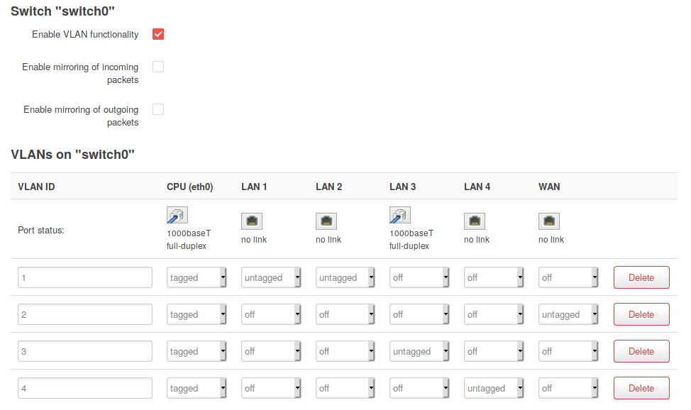
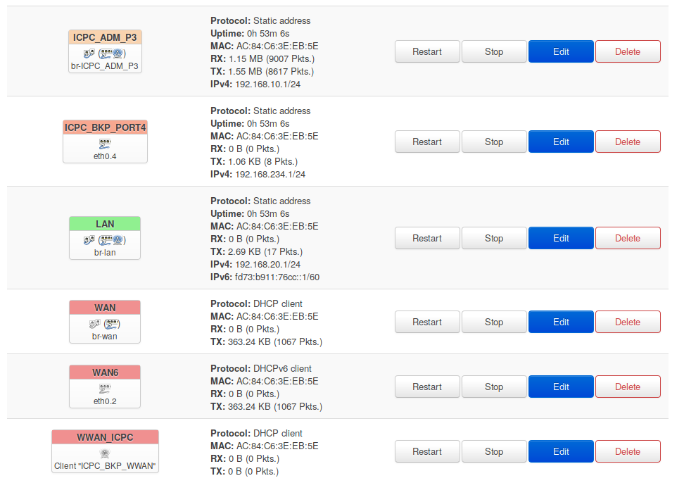

# Fallback Network Topology used on ICPC Chile 2019

This is a brief introduction on how fallback networking works for ICPC Chile 2019. Fallback network allows seamless connection of a "fake" gateway with direct internet access in case of the main configuration fails to perform.

You can also find this guide on my [dev blog](https://mimashita.moe/dev.html).

For this topology to work you'll need the following elements

* A 4G modem (Ehternet is optional on this one)
* TP-Link AC1750 Wireless Dual band Gigabit Router
* A switch (usually  provided by the host university)

## Why the AC1750
The AC1750 is a very (VERY) capable router, has independent 2.4GHz and 5GHz wireless radios, 2 USB ports, ON/OFF killswitch, 4 LAN Gigabit Ethernet ports and 1 WAN Gigabit Ethernet port... And on top of it: Runs OpenWRT. For this tutorial we'll assume that you already have OpenWRT installed on your device, if not, [here is a guide on how to configure OpenWRT for your Archer](https://mimashita.moe/dev/home-made_timecapsule.html).

In a practical sense, any wireless router will do the trick but this one hits the spot on both price tag and capabilities.

## Switch and VLAN configuration


## Virutal Interfaces


Details of the implementation:


| Interface      | Firewall Zone | IP Ranges        | Protocol       | Usage                     |
|----------------|---------------|------------------|----------------|---------------------------|
| ICPC_ADM_P3    | eth0.3        | 192.168.10.0/24  | Static Address | Administration            |
| ICPC_BKP_PORT4 | eth0.4        | 192.168.234.0/24 | Static Address | For contestant network    |
| LAN            | lan           | 192.168.20.1     | Static Address | General Purpose wired LAN |
| WAN            | wan           |                  | DHCP Client    | Wired WAN connection      |
| WWAN_ICPC      | wan           |                  | DHCP Client    | Wireless WAN connection   |

## Features to be considered
### Local tunneling for LuCi and dedicated VLAN port
While not mandatory, it's recommended to isolate the administrative interface for LuCi to only listed on *certain* interfaces. For those effects, the administrative interfaces will be a virtual bridged port between the Wireless Antenna `ICPC_ADM_BKP` and the `LAN4` port.

### Client Isolation
### Administrative VLAN


## Directory tree for /etc/
```bash
etc
├── config
│   ├── dhcp
│   ├── dropbear
│   ├── firewall
│   ├── luci
│   ├── network
│   ├── rpcd
│   ├── system
│   ├── ubootenv
│   ├── ucitrack
│   ├── uhttpd
│   ├── uhttpd.backup
│   └── wireless
├── dropbear        #You must update yourself those files
│   ├── authorized_keys         
│   └── dropbear_rsa_host_key
├── group
├── hosts
├── inittab
├── luci-uploads
├── opkg
│   └── keys
│       ├── 1035ac73cc4e59e3
│       ...
│       └── dd6de0d06bbd3d85
├── passwd
├── profile
├── rc.local
├── shadow
├── shells
└── sysctl.conf
```

## LuCi tunnel config
```bash
# ~/.ssh/config
Host LuCI-Tunnel
	Hostname 192.168.10.1
	Port 22
	User root
	LocalForward 127.0.0.1:8000 127.0.0.1:80
```


## LuCi tunnel config
```bash
# ~/.ssh/config
Host LuCI-Tunnel
	Hostname 192.168.10.1
	Port 22
	User root
	LocalForward 127.0.0.1:8000 127.0.0.1:80
```